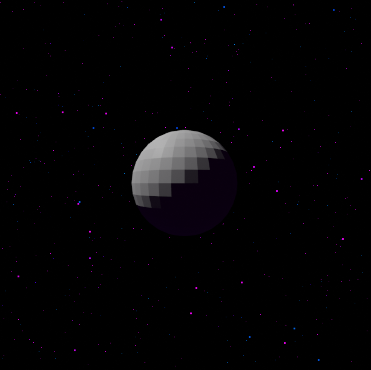
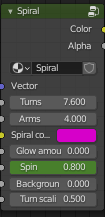
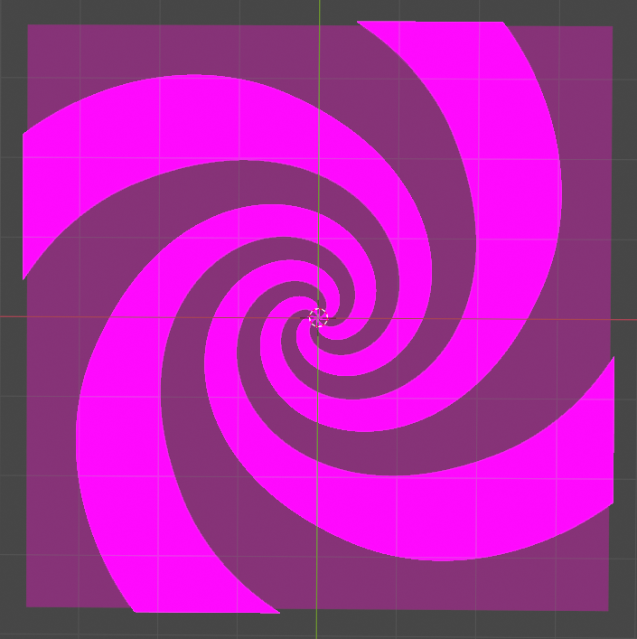
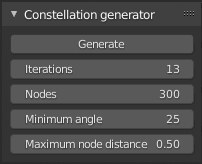
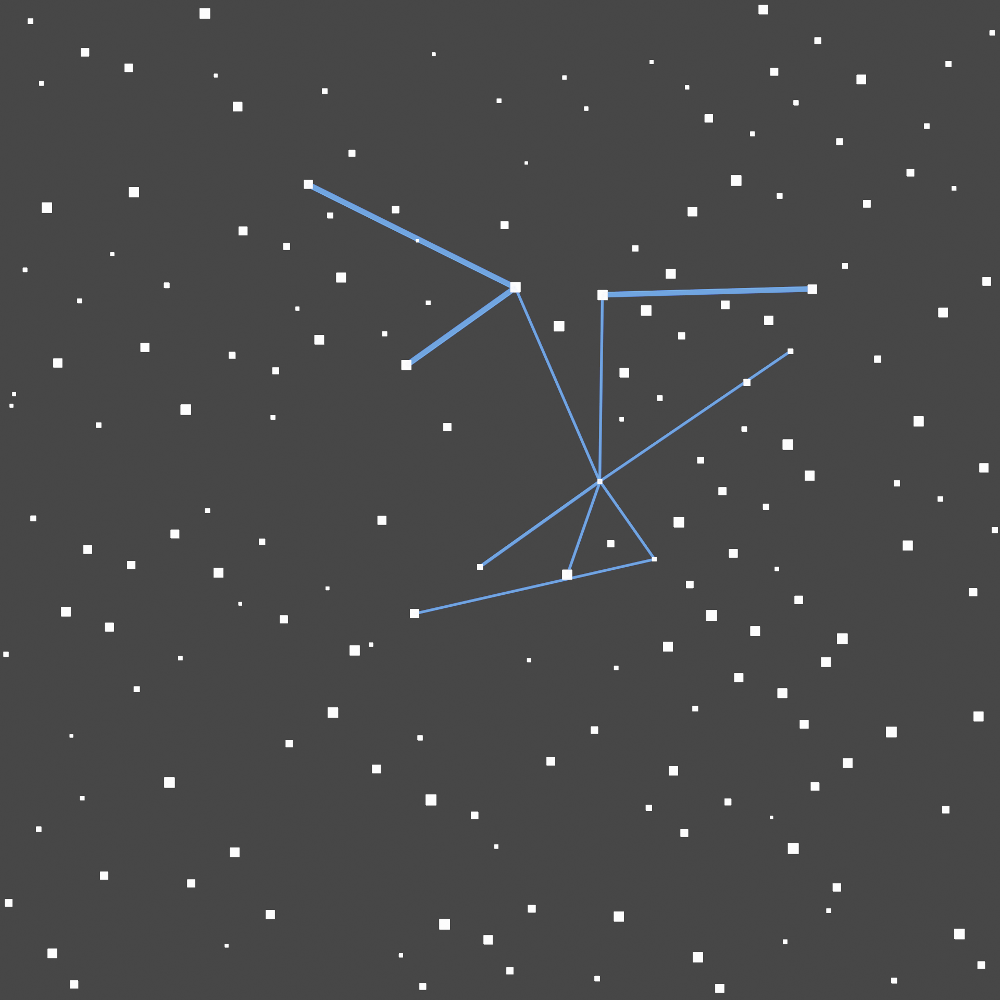
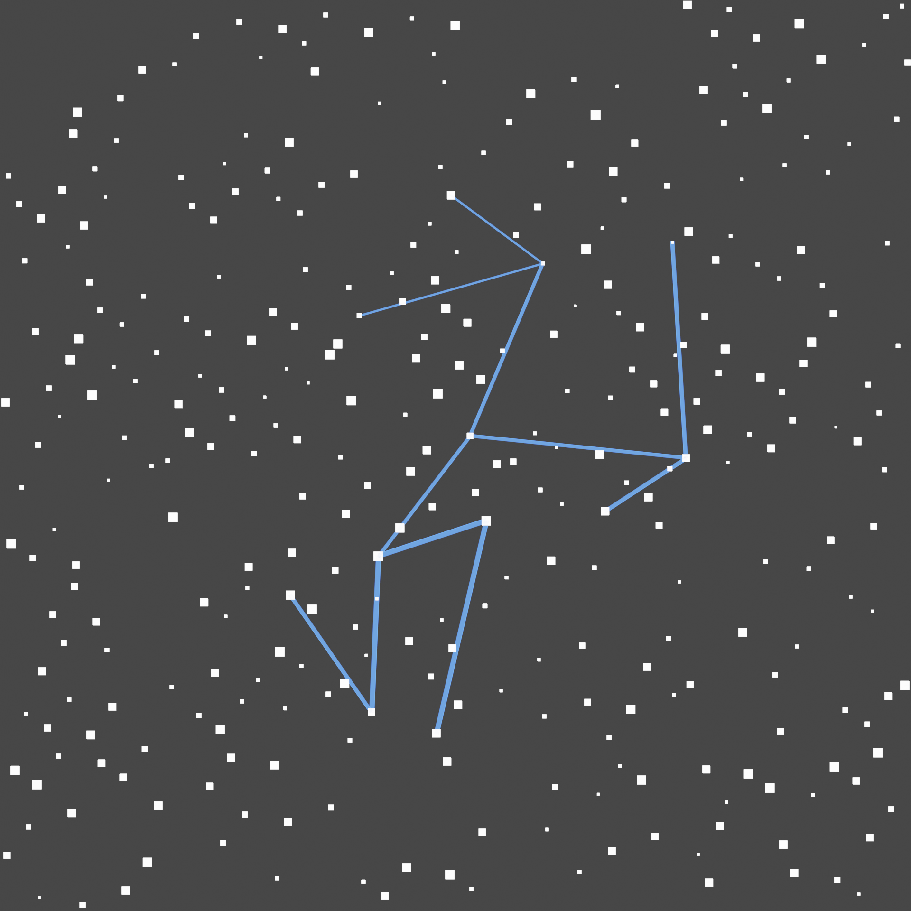
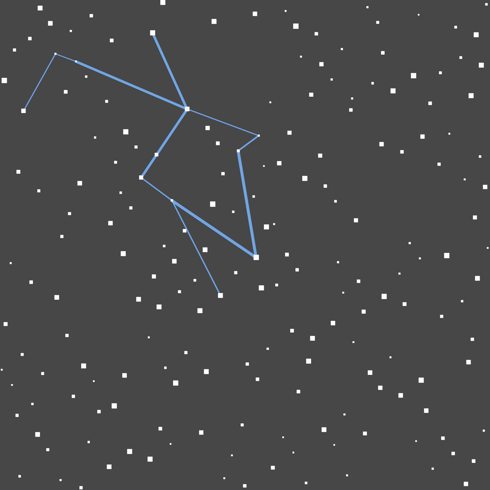
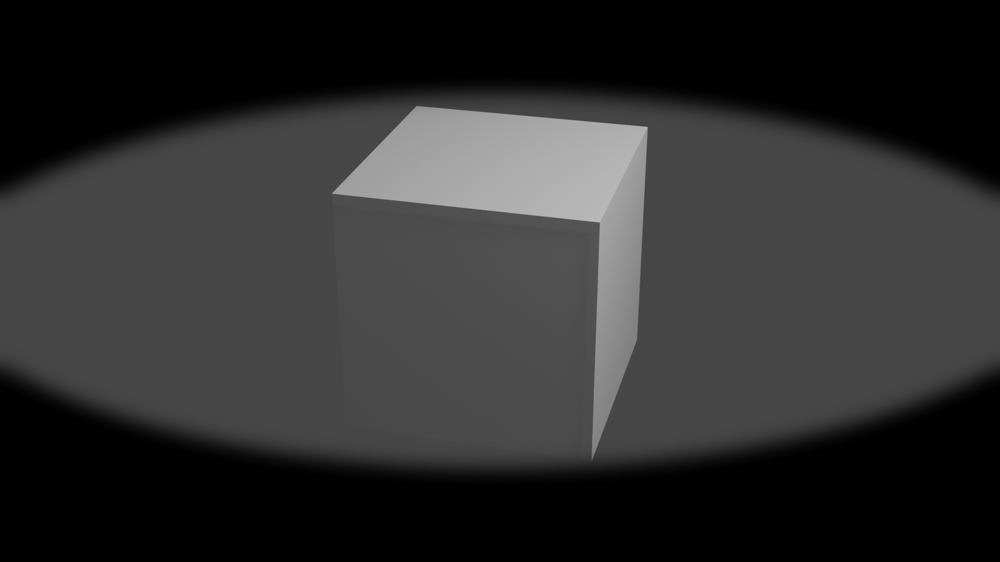
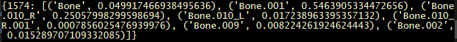
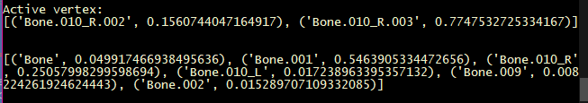

# Useful Blender node groups, utilities and scripts
## starfield
Just a coloured random starfield shader


## spiral
A customizable spiral generator node group



The ```Spin``` value can be animated to make the spiral spin.



## constellations
A customizable random constellation generator with UI script







Uses a ```Particle System``` to generate the nodes, then runs a simple algorithm to iteratively add links between them using ```Stretch To``` constraints.

## eyelids
A first person eyelids closing effect compositor node group, has a single value that can be animated representing how open or closed the eyelids are.



<!-- <video width="320" height="240" controls>
    <source src="readme_files/eyelids.mp4" type="video/mp4">
    <source src="readme_files/eyelids.webm" type="video/webm">
</video> -->

With a blur effect applied (see blender file)

## get_vertex_groups.py

Simple script to get the vertex groups selected vertices belong to along with the weights of each vertex in group.
This is needed because apparently there is no way to do this in the blender UI.
The output is written to the system console ("Window -> Toggle system console" to enable) in the following format:
```
{<vertex id>: [('<node group name>', <weight of vertex in node group>), ...]}
```
Example output with some very helpfully named node groups:



## xor_vertex_groups.py

Slightly more complex script to compare vertex groups of two different vertices. The script outputs a list of all vertex groups for each node that are unique to it, along with weights for each group. Helpful for figuring out what bone is moving a vertex around.

